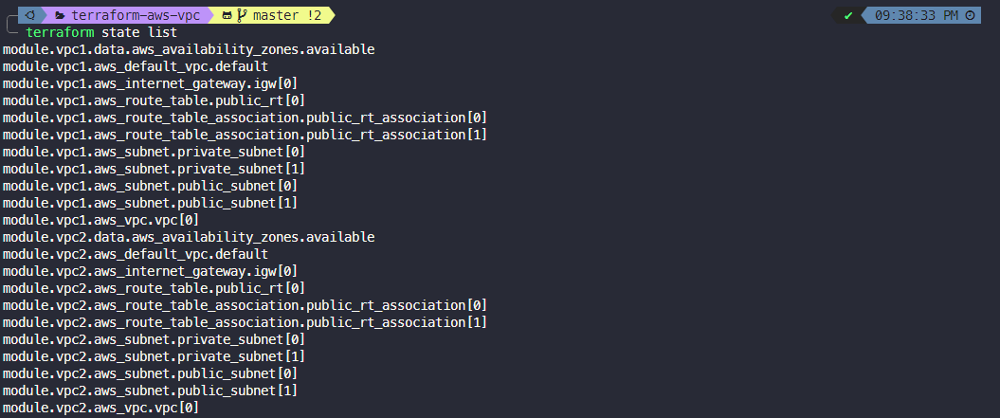

<h2 align="center">terraform_aws_vpc 🚀</h2>
<p align="center">This repo is created for vpc and subnets creation with terraform. </p>  

>💡 Can use this vpc module for EC2, EKS, ECS and more.   

## Module input and output  
module location: [modules/wy_vpc](modules/wy_vpc)

### Input

| Input                   | Default Value                                            |
| :---------------------- | :------------------------------------------------------- |
| project_name            | terraform_aws_vpc                                        |
| env_prefix              | test                                                     |
| vpc_cidr                | "10.90.0.0/16"                                           |
| azs                     | It will use automatically available AZs in region        |
| public_subnet_cidr      | depends on your numbers of cidr block                    |
| private_subnet_cidr     | depends on your numbers of cidr block                    |
| create_nat              | False                                                    |
| public_subnet_for_nat   | 0 (means: it will create in the first public subnet)     |

## Output
- all of vpc attributes
- all of public subnets ids
- all of private subnets ids

> Can adjust input and output values in <code>variable.tf</code> and <code>output.tf</code>
## example usage: 
```hcl
module "vpc1" {
  source                = "github.com/wwwaiyan/terraform-aws-vpc/modules/wy_vpc"
  project_name          = var.project_name
  env_prefix            = var.env_prefix1
  vpc_cidr              = var.vpc_cidr1
  public_subnet_cidr    = var.public_subnet_cidr1
  private_subnet_cidr   = var.private_subnet_cidr1
  create_nat            = var.create_nat #required public_subnet_cidr
  public_subnet_for_nat = var.public_subnet_for_nat
  azs                   = var.azs
}
module "vpc2" {
  source                = "github.com/wwwaiyan/terraform-aws-vpc/modules/wy_vpc"
  project_name          = var.project_name
  env_prefix            = var.env_prefix2
  vpc_cidr              = var.vpc_cidr2
  public_subnet_cidr    = var.public_subnet_cidr2
  private_subnet_cidr   = var.private_subnet_cidr2
  create_nat            = var.create_nat #required public_subnet_cidr
  public_subnet_for_nat = var.public_subnet_for_nat
  azs                   = var.azs
}
```
### 1. Clone the repo and Go to the module directory 
```
git clone https://github.com/wwwaiyan/terraform-aws-vpc.git && cd terraform-aws-vpc
```  
can edit the values in `variable.tf` or `main.tf`  
### 2. Run `terraform init` and `terraform apply` Command  
```
terraform init && terraform apply
```
we can check terraform state with `terraform state list` command  

In this case, it will create eks cluster with root module  
✔️ Created 2 VPC  
✔️ Created 2 Public Subnets with IGW in each vpc  
✔️ Created 2 Private Subnets with NAT Gateway in each vpc   

Can check vpc resource map in aws console  
  

## screenshots: 
  

### 3. Cleanup your resources.  
Run `terraform destroy` command.  

<H3 align="center">Happy Coding! Happy Clustering... 🌟🚀😊</H3>