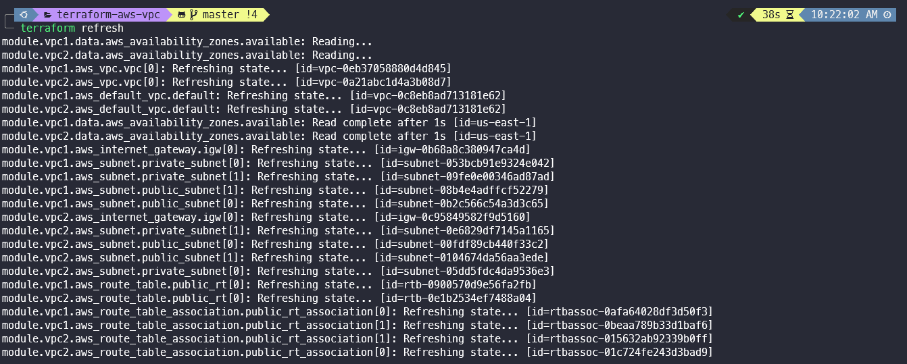
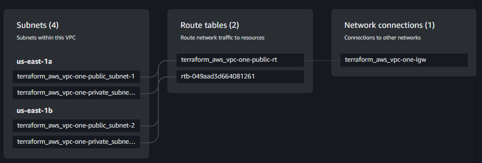

# terraform_aws_vpc
This repo is created for vpc and subnets creation with terraform.   
Can use this vpc module for EC2, EKS, ECS and more.  
vpc module in modules/wy_vpc  
<code>github.com/wwwaiyan/terraform-aws-vpc/modules/wy_vpc</code>  
## example usage: 
```
module "vpc" {
  source             = "github.com/wwwaiyan/terraform-aws-vpc/modules/wy_vpc"
  project_name       = var.project_name
  env_prefix         = var.env_prefix
  public_subnet_cidr = ["10.90.1.0/24", "10.90.2.0/24"]
}
```
in this case I will create vpc with root module
- 2 VPC
- 2 Public Subnets with IGW in each vpc
- 2 Private Subnets with NAT Gateway in each vpc  

Run <code>terraform plan</code> and <code>terraform apply</code> Commands  
we can check terraform state with <code>terraform refresh</code> command  

Can check in vpc resource map in aws console  


## Module input and output  
module location: [modules/wy_vpc](modules/wy_vpc)

### Input

| Input                   | Default Value                                            |
| :---------------------- | :------------------------------------------------------- |
| project_name            | terraform_aws_vpc                                        |
| env_prefix              | test                                                     |
| vpc_cidr                | "10.90.0.0/16"                                           |
| azs                     | It will use automatically available AZs in region        |
| public_subnet_cidr      | depends on your numbers of cidr block                     |
| private_subnet_cidr     | depends on your numbers of cidr block                     |
| create_nat              | False                                                    |
| public_subnet_for_nat   | 0 (means: it will create in the first public subnet)     |

## Output
- all of vpc attributes
- all of public subnets ids
- all of private subnets ids

> Can adjust input and output values in <code>variable.tf</code> and <code>output.tf</code>